# LeEngVocab

LeEngVocab là một ứng dụng web được phát triển để cung cấp các dịch vụ học từ vựng cho người dùng, bao gồm các chức năng quản lý người dùng, từ vựng, hồ sơ người dùng và các dịch vụ xác thực. Dự án sử dụng kiến trúc microservices với các dịch vụ được triển khai trên Kubernetes.

## Mô tả dự án

Ứng dụng bao gồm các dịch vụ chính sau:

- **Frontend**: Giao diện người dùng được xây dựng bằng ReactJS, nơi người dùng có thể tương tác với hệ thống và học từ vựng.
- **Auth Service**: Dịch vụ xác thực người dùng.
- **User Profile Service**: Dịch vụ quản lý thông tin hồ sơ người dùng.
- **Vocabulary Service**: Dịch vụ quản lý và truy vấn từ vựng.
- **MongoDB**: Cơ sở dữ liệu NoSQL dùng để lưu trữ dữ liệu của ứng dụng.

## Kiến trúc

Dự án được triển khai theo kiến trúc microservices và sử dụng Kubernetes để quản lý các container dịch vụ. Các dịch vụ giao tiếp với nhau qua HTTP thông qua Ingress và sử dụng các API RESTful. Các container dịch vụ được kết nối với nhau qua mạng của Kubernetes và các dịch vụ sẽ được bảo vệ bằng các biện pháp bảo mật như JWT (JSON Web Tokens) cho việc xác thực và phân quyền.

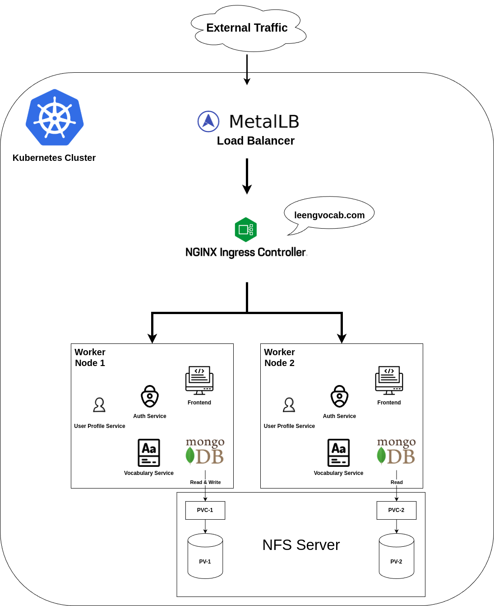

## Kubernetes Resources

### Nodes

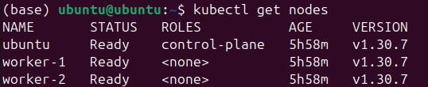

### Volumes

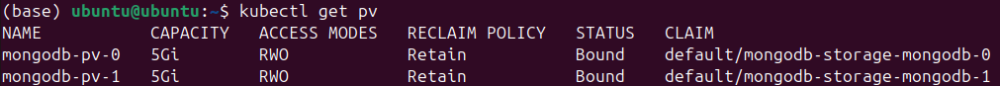

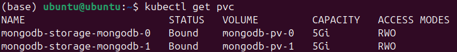

### Configmaps

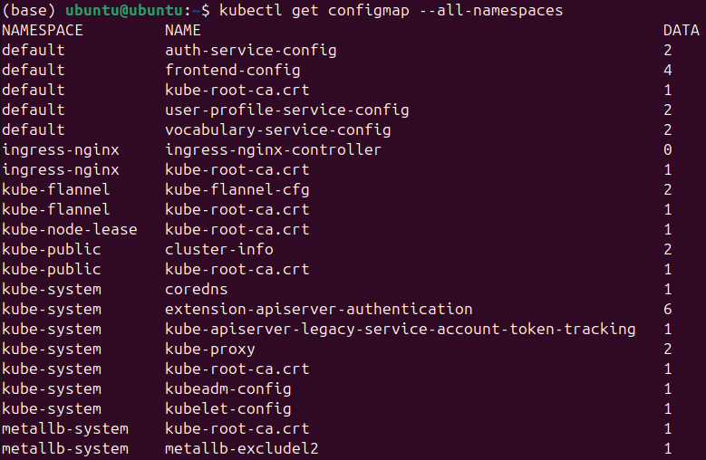

### Secret

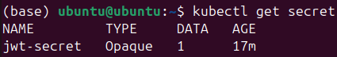

### Pods

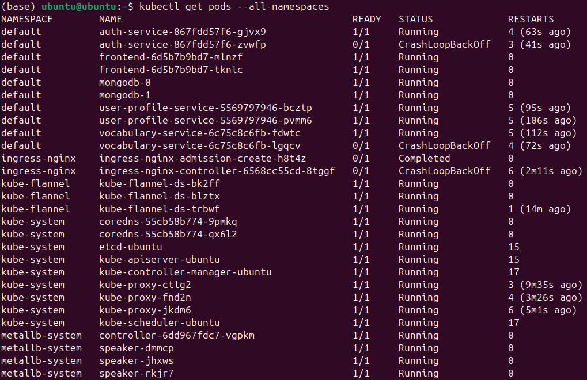

### Statefulset

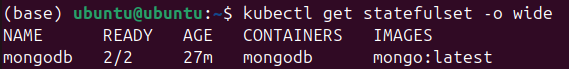

### Services

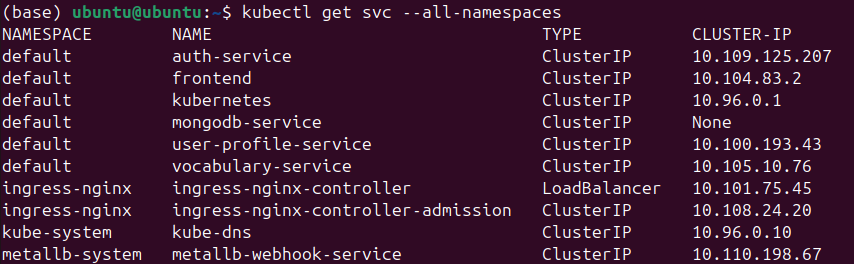

### Ingress

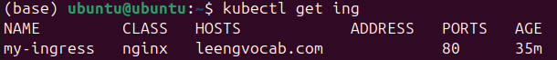

## Demo

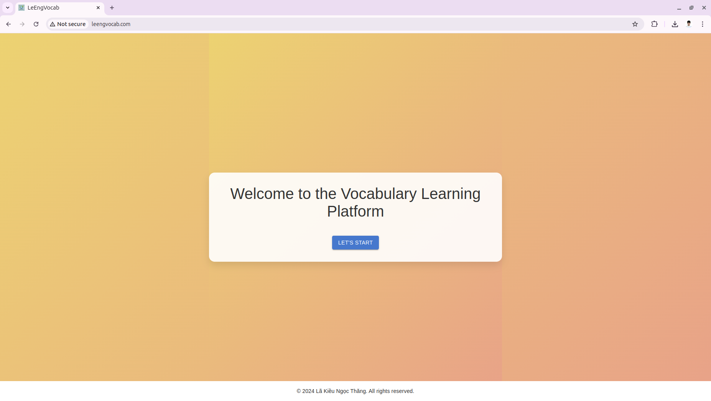

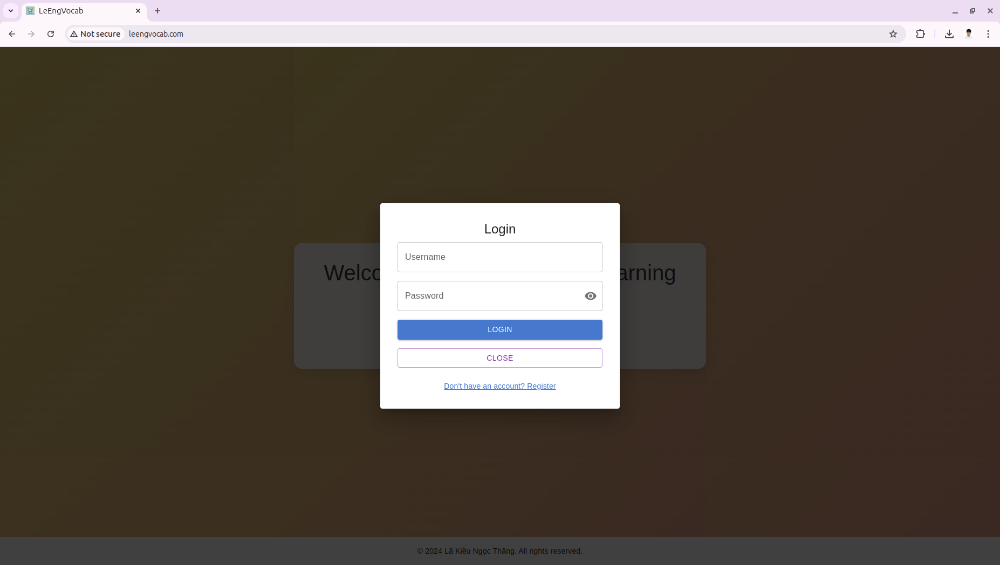